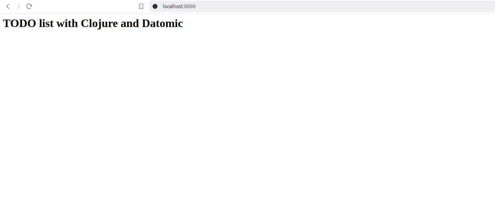
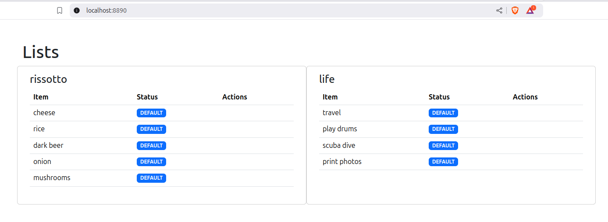

Title: Building a TODO List App with Clojure + Datomic Pro - [Part 2]
Date: 2025-02-19
Tags: clojure, datomic

In Part I we completed the following

- Have a running Datomic database and interact through Clojure code
- Create and transact the schema for the project
- Explore query in the REPL

### Create a simple UI

Next step is to be able to display the database in a simple UI in the browser. To render data in the browser we'll use two more libraries, [Pedestal](http://pedestal.io/pedestal/0.7/index.html) for HTTP server and [Hiccup](https://github.com/weavejester/hiccup) for HTML rendering.

A rough design that we will use

IMAGE

To start with, let's build the HTTP server and the [Hiccup](https://github.com/weavejester/hiccup/wiki/Syntax) skeleton, then we will populate it with the results from Datomic.

**Pedestal routes**

```clojure
(defn hello-html
  "Receives Pedestal request map and returns a simple html text"
  [_request]
  {:status  200
   :headers {"Content-Type" "text/html; charset=utf-8"}
   :body    (str (h/html [:h1 "TODO list with Clojure and Datomic"]))})

(def routes
  (route/expand-routes
   #{["/" :get hello-html :route-name :home]}))
```

*more about [Pedestal routes](http://pedestal.io/pedestal/0.7/guides/defining-routes.html)*

To continue let's pass the routes to the server and add some functions to start stop and restart the server

```clojure
(defn create-server []
  (http/create-server
    {::http/routes routes
     ::http/secure-headers {:content-security-policy-settings "object-src 'none'; script-src 'self' 'unsafe-inline' 'unsafe-eval' https: http:;"}
     ::http/type :jetty
     ::http/port 8890
     ::http/join? false}))

(defonce server (atom nil))

(defn start-server []
  (reset! server (-> (create-server) http/start)))

(defn stop-server []
  (swap! server http/stop))

(defn restart-server []
  (stop-server)
  (start-server))
```

We can call `(start-server)` in the REPL and navigate to navigate to http://localhost:8890/ in the browser , we should see something like this.

With a working HTTP  we will build the HTML (hiccup) skeleton.

```clojure
(ns server
  (:require
   [hiccup.page :as hp]
   [hiccup2.core :as h]
   [io.pedestal.http :as http]
   [io.pedestal.http.route :as route]))


(def db-example
  [{:list/name "rissotto"
    :list/items [{:item/text "cheese"}
                 {:item/text "rice"}
                 {:item/text "dark beer"}
                 {:item/text "onion"}
                 {:item/text "mushrooms"}]}
   {:list/name "life"
    :list/items [{:item/text "travel"}
                 {:item/text "play drums"}
                 {:item/text "scuba dive"}
                 {:item/text "print photos"}]}])

(defn gen-page-head
  "Include bootstrap css and js"
  [title]
  [:head
   [:title title]
   (hp/include-css "https://cdn.jsdelivr.net/npm/bootstrap@5.3.3/dist/css/bootstrap.min.css")
   (hp/include-js "https://cdn.jsdelivr.net/npm/bootstrap@5.3.3/dist/js/bootstrap.bundle.min.js")])

(defn all-lists-page
  "Renders the TODO list page"
  [_request]
  (str
   (h/html
    (gen-page-head "Datolister")
    [:div {:class "container" :style "padding-top: 50px"}
     [:h1 "Lists"]
     [:div {:class "row row-cols-2"}
      (for [list db-example
            :let [list-name (:list/name list)]]
        [:div {:class "col card"}
         [:div {:class "card-body"}
          [:h4 {:class "card-title"} list-name]
          [:table {:class "table mb-4"}
           [:thead
            [:tr
             [:th {:scope "col"} "Item"]
             [:th {:scope "col"} "Status"]
             [:th {:scope "col"} "Actions"]]]
           [:tbody
            (for [item (:list/items list)]
              [:tr
               [:td (get item :item/text)]
               [:td
                [:span {:class "badge text-bg-light"} "DEFAULT"]]
               [:td
                [:div {:class "row row-cols-auto row-cols-sm"}]]])]]]])]])))
```

We define `db-example` because we are not going to query Datomic yet (patience), this is a great exercise because it's one option to model our data that works to serve the page as we want, that will be a great guide on how to construct our queries. Second, for those familiar with basic HTML we are creating a table. To add the values we want we loop over the `db-example` which is a vector of maps, each map is a "List", inside the list we have `:list/items` and then we  loop again to render all the items for each list.

Let's glue all things together in one file `src/server.clj`

```clojure
(ns server
  (:require
   [hiccup.page :as hp]
   [hiccup2.core :as h]
   [io.pedestal.http :as http]
   [io.pedestal.http.route :as route]))

(def db-example
  [{:list/name "rissotto"
    :list/items [{:item/text "cheese"}
                 {:item/text "rice"}
                 {:item/text "dark beer"}
                 {:item/text "onion"}
                 {:item/text "mushrooms"}]}
   {:list/name "life"
    :list/items [{:item/text "travel"}
                 {:item/text "play drums"}
                 {:item/text "scuba dive"}
                 {:item/text "print photos"}]}])

(defn gen-page-head
  "Include bootstrap css and js"
  [title]
  [:head
   [:title title]
   (hp/include-css "https://cdn.jsdelivr.net/npm/bootstrap@5.3.3/dist/css/bootstrap.min.css")
   (hp/include-js "https://cdn.jsdelivr.net/npm/bootstrap@5.3.3/dist/js/bootstrap.bundle.min.js")])

(defn all-lists-page
  "Renders the TODO list page"
  [_request]
  (str
   (h/html
    (gen-page-head "Datolister")
    [:div {:class "container" :style "padding-top: 50px"}
     [:h1 "Lists"]
     [:div {:class "row row-cols-2"}
      (for [list db-example
            :let [list-name (:list/name list)]]
        [:div {:class "col card"}
         [:div {:class "card-body"}
          [:h4 {:class "card-title"} list-name]
          [:table {:class "table mb-4"}
           [:thead
            [:tr
             [:th {:scope "col"} "Item"]
             [:th {:scope "col"} "Status"]
             [:th {:scope "col"} "Actions"]]]
           [:tbody
            (for [item (:list/items list)]
              [:tr
               [:td (get item :item/text)]
               [:td
                [:span {:class "badge text-bg-light"} "DEFAULT"]]
               [:td
                [:div {:class "row row-cols-auto row-cols-sm"}]]])]]]])]])))

(defn html-200 [body]
  {:status  200
   :headers {"Content-Type" "text/html; charset=utf-8"}
   :body    body})

(def routes
  (route/expand-routes
   #{["/" :get (comp html-200 all-lists-page) :route-name :home]}))

(defonce server (atom nil))

(defn start-server []
  (reset! server (-> (create-server) http/start)))

(defn stop-server []
  (swap! server http/stop))

(defn restart-server []
  (stop-server)
  (start-server))
```

then in the REPL

```clojure
;; REPL
(start-server)
```

now let's got to our browser and navigate to http://localhost:8890/ , we should see something like this.



Awesome, we have our beautiful UI working, we don't need anything else for now. Next step is to fetch the data from Datomic instead of db-example. Let's go back to the `src/todo_db.clj` file and take a look at the query we use previously to fetch lists and items.

```clojure
(d/q '[:find (pull ?list [:list/name {:list/items [:item/text]}])
       :in $
       :where [?list :list/name ?list-name]]
     (d/db conn))
```

```clojure
;; =>
 [[#:list{:name "rissotto",
         :items
         [#:item{:text "cheese"}
          #:item{:text "rice"}
          #:item{:text "dark beer"}
          #:item{:text "onion"}
          #:item{:text "mushrooms"}]}]
 [#:list{:name "life",
         :items
         [#:item{:text "travel"}
          #:item{:text "play drums"}
          #:item{:text "scuba dive"}
          #:item{:text "print photos"}]}]]
```

It's actually very close to what we want, instead of vectors of maps we have vector of vectors. We want to tell Datomic to bind the results into a collection, we can make use of the [binding forms](https://docs.datomic.com/query/query-data-reference.html#binding-forms), particularly the collection one `[?a ...]` , this tells Datomic to return the results as a collection of the results, it's a way to flatten the results.

```clojure
(d/q '[:find [(pull ?list [:list/name {:list/items [:item/text]}]) ...]
       :in $
       :where [?list :list/name ?list-name]]
     (d/db conn))
```

```clojure
;; =>
[#:list{:name "rissotto",
        :items
        [#:item{:text "cheese"}
         #:item{:text "rice"}
         #:item{:text "dark beer"}
         #:item{:text "onion"}
         #:todo{:text "mushrooms"}]}
 #:list{:name "life",
        :items
        [#:item{:text "travel"}
         #:item{:text "play drums"}
         #:item{:text "scuba dive"}
         #:item{:text "print photos"}]}]
```

The result is in the form we need, now it's matter of making the query and passing the result to the render function. Before that we create a `lists-page` function that will execute the query and place it inside `todo_db.clj`. We will also add the `:db/id` in our query result because that's the id we will use to update or retract datoms and also include the item status, `:item/status`.

```clojure
(defn lists-page [db]
  (d/q '[:find [(pull ?list [:db/id :list/name {:list/items [:db/id :item/text {:item/status [:db/ident]}]}]) ...]
         :in $
         :where [?list :list/name ?list-name]]
       db))
```

*more about :db/ident [here](https://docs.datomic.com/schema/identity.html#idents)*

In the `server.clj` file we make some modifications to our `all-lists-page` render function.

```clojure
(ns server-experiment
  (:require
   [datomic.api :as d] ;; new
   [hiccup.page :as hp]
   [hiccup2.core :as h]
   [io.pedestal.http :as http]
   [io.pedestal.http.route :as route]
   [todo-db :as todo-db])) ;; new

(defn all-lists-page
  "Renders the TODO list page"
  [_request]
  (str
   (h/html
    (gen-page-head "Datolister")
    [:div {:class "container" :style "padding-top: 50px"}
     [:h1 "Lists"]
     [:div {:class "row row-cols-2"}
      (for [list (todo-db/lists-page (d/db todo-db/conn)) ;; Important line
            :let [list-name (:list/name list)]]
        [:div {:class "col card"}
         [:div {:class "card-body"}
          [:h4 {:class "card-title"} list-name]
          [:table {:class "table mb-4"}
           [:thead
            [:tr
             [:th {:scope "col"} "Item"]
             [:th {:scope "col"} "Status"]
             [:th {:scope "col"} "Actions"]]]
           [:tbody
            (for [item (:list/items list)
                  :let [item-text (get item :item/text)
                        item-status (get-in item [:item/status :db/ident])]]
              [:tr
               [:td item-text]
               [:td
                [:span {:class "badge text-bg-light"} item-status]]
               [:td
                [:div {:class "row row-cols-auto row-cols-sm"}]]])]]]])]])))

```

the `todo-db/list-page` receives a db as parameter, to get the current db in Datomic we call `d/db` which receives a connection and for this project we define the connection inside the `todo-db/conn`.  Once we have the query result we just change the value we were passing to the `for` and we should be able to get the same result. Load the file to the REPL and call `(restart-server)` then go to http://localhost:8890/  hit reload and you should see the the items with the status too, all served by Datomic.

### Resources

- [Pedestal routes](http://pedestal.io/pedestal/0.7/guides/defining-routes.html)
- [Hiccup basic syntax](https://github.com/weavejester/hiccup/wiki/Syntax)
- [Datomic - :db/ident](https://docs.datomic.com/schema/identity.html#idents)